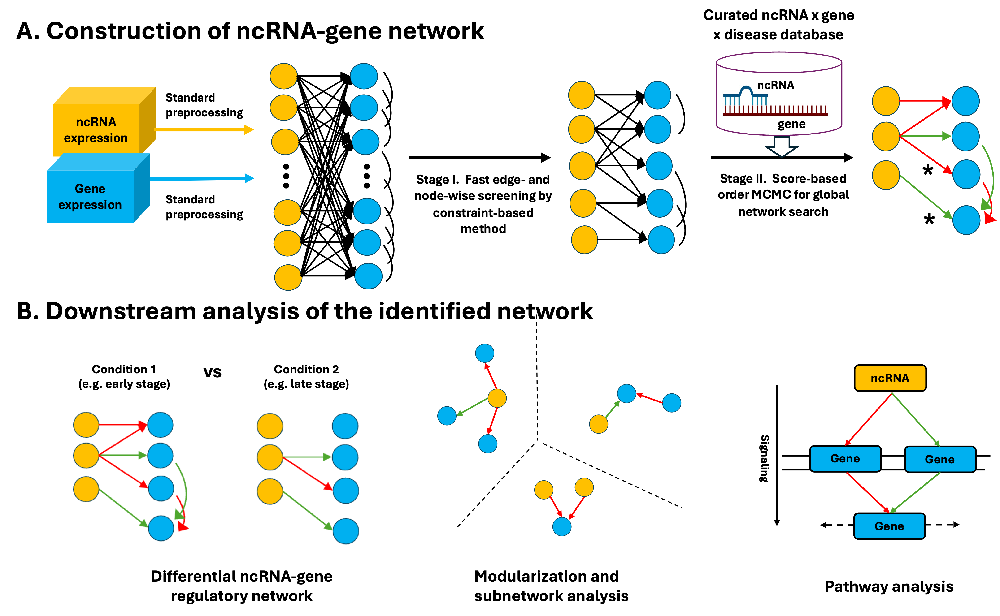

# CAR-NET
CAR-NET is a RShiny-based application with graphical user interface (GUI) for inferring non-coding RNA regulatory network from transcriptomic data and curated database. This application took input of both ncRNA and gene expression data generated from either bulk or single-cell RNA-seq and incorporated a list of downloaded curated databases for users to choose based on the type of ncRNA and the condition/disease of interest. It includes a preparatory step to preprocess the expression data following the standard pipeline and major analytical steps to construct the ncRNA regulatory network, identify the differential network, detect network modules, and perform pathway analysis to facilitate the biological interpretation of the network findings. In addition, it provides visualization of the network/modules and downloadable graphical and tabular outputs. 




## Requirement
* R >= 4.0.0
* Rcpp >= 1.0.0
* Shiny >= 1.0.0

## Download the Shiny software
1. Download the CAR-NET Shiny project at [https://github.com/kehongjie/CAR-NET](https://github.com/kehongjie/CAR-NET) by clicking on "code > Download ZIP".
2. Unzip and extract to a local folder named "CAR-NET-main".

## Start the Shiny software
1. Open "RunShiny.R" file from the "CAR-NET-main" folder in R console.
2. Set the working directory of R to the directory which contains the Shiny project folder "CAR-NET-main" `setwd("path\_to\_Rshiny/")`.
3. Run the code `shiny::runApp('CAR-NET-main', port=9987, launch.browser=T)` and the CAR-NET Shiny app will automatically open in your default browser.

## Where to find the full tutorial 
After starting CAMO, users need to select a local directory as the working directory in the Setting page before any analysis. Please refer to the full tutorial for details at xxx.

## Dependency packages 
Before running CAR-NET, please make sure all dependency packages are installed. The following code for installing dependency pakcages can be used:
```R
## from CRAN
CRAN.packages <- function(pkg){
    new.pkg <- pkg[!(pkg %in% installed.packages()[, "Package"])]
    if (length(new.pkg)) 
        install.packages(new.pkg, dependencies = TRUE)
}
CRAN.packages(c("devtools", "igraph", "gridExtra", "grid", "ggplot2", "gplots", "reticulate"))

## from Bioconductor
Bioconductor.packages <- function(pkg){
    new.pkg <- pkg[!(pkg %in% installed.packages()[, "Package"])]
    if (length(new.pkg)) 
        BiocManager::install(new.pkg, dependencies = TRUE)
}
Bioconductor.packages(c("DESeq2", "limma", "ConsensusClusterPlus", "pathview", "KEGGgraph", "KEGGREST", "org.Hs.eg.db", "org.Mm.eg.db", "org.Rn.eg.db", "org.Dm.eg.db", "reactome.db"))
```


