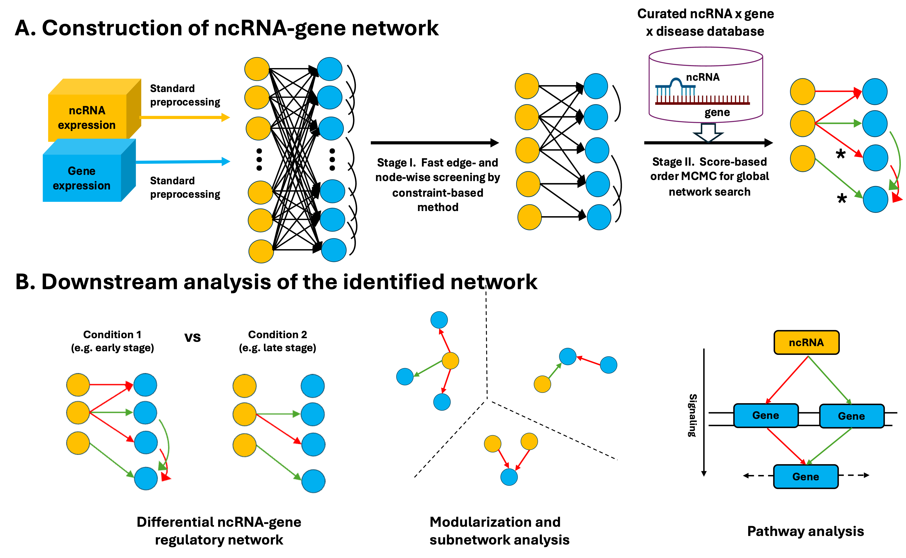

# CAR-NET
CAR-NET is an R Shiny-based application with graphical user interface (GUI) for inferring non-coding RNA regulatory networks from transcriptomic data and curated databases. This application takes both ncRNA and gene expression data generated from either bulk or single-cell RNA-seq and incorporates curated databases for users to choose based on the type of ncRNA and the condition/disease of interest. It includes a preparatory step to preprocess the expression data following the standard pipeline and major analytical steps to construct the ncRNA regulatory network, identify the differential network, detect network modules, and perform pathway analysis to facilitate the biological interpretation of the network findings. In addition, it provides visualization of the network/modules and downloadable graphical and tabular outputs.




## Requirement
* R >= 4.0.0
* Rcpp >= 1.0.0
* Shiny >= 1.0.0

## Download the Shiny software
1. Download the CAR-NET Shiny project at [https://github.com/kehongjie/CAR-NET](https://github.com/kehongjie/CAR-NET) by clicking on "code > Download ZIP".
2. Unzip and extract to a local folder named "CAR-NET-main".

## Start the Shiny software
1. Open an R console from the CAR-NET repository root.
2. Run `shiny::runApp(".", port = 9987, launch.browser = TRUE)` and the CAR-NET Shiny app will automatically open in your default browser.
3. Alternatively, run the included `RunShiny.R` launcher from the repository root.

The Data Uploading and Preprocessing tab includes a TCGA_KIRP example that can be selected from the data-source dropdown.

## Dependency packages 
Before running CAR-NET, please make sure all dependency packages are installed. The following code for installing dependency packages can be used:
```R
## from Bioconductor (run this first)
if (!requireNamespace("BiocManager", quietly = TRUE)) {
    install.packages("BiocManager")
}

Bioconductor.packages <- function(pkg){
    new.pkg <- pkg[!(pkg %in% installed.packages()[, "Package"])]
    if (length(new.pkg)) 
        BiocManager::install(new.pkg, dependencies = TRUE)
}
Bioconductor.packages(c("RBGL", "Rgraphviz", "graph"))
## from CRAN
CRAN.packages <- function(pkg){
    new.pkg <- pkg[!(pkg %in% installed.packages()[, "Package"])]
    if (length(new.pkg)) 
        install.packages(new.pkg, dependencies = TRUE)
}
CRAN.packages(c("devtools", "igraph", "BiDAG", "ggplot2", "CCA", "CCP", "pheatmap", "MASS", "rainbow"))

```

## Where to find the full tutorial 
Please refer to the [CAR-NET R Shiny Tutorial](tutorial/CAR-NET_tutorial.html) for the polished webpage version. The Markdown source is also available at [tutorial/CAR-NET_tutorial.md](tutorial/CAR-NET_tutorial.md).
